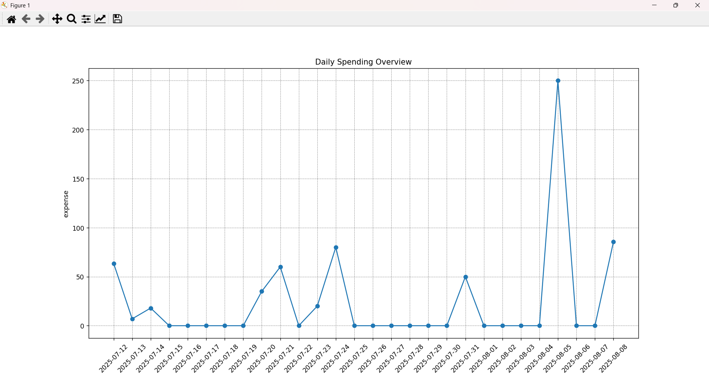
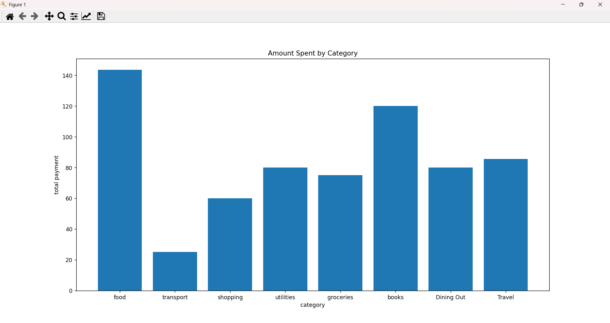

# Expense Tracker - Phase 3

## Project Overview
This project is an expense tracker application that allows users to record expenses in multiple currencies, automatically convert them to EUR, manage dynamic expense categories, and generate summary reports and visual charts.

## Key Features of Phase 3
- Multi-currency expense entry with automatic conversion to EUR using a currency exchange API  
- Dynamic management of categories, including interactive addition of new categories  
- Expense data stored in CSV files  
- Generation of summary reports in CSV and Excel formats  
- Visualization of expenses with daily line charts and category bar charts using matplotlib  
- Command-line interface (CLI) with commands: 'add', 'view', 'summary', and 'visualize'

## Project Structure
- Main program files are located in the root directory  
- Data files: 'expenses.csv', 'rates.json'  
- Report files: 'report.csv', 'report.xlsx'  
- Chart images stored inside the 'images/' folder

## How to Run

### Install Dependencies

pip install -r requirements.txt

**Note:** 'requirements.txt' includes:

pandas
matplotlib
requests
openpyxl

### Using the Program

#### Add a new expense:

python main.py add --amount 50 --date 2025-08-01 --category food --description "Lunch" --currency USD

#### View expenses:

python main.py view --last 5

#### Generate a summary report:

python main.py summary

#### Plot expense charts:

python main.py visualize

## Sample Outputs

### Daily Expenses Line Chart

### Category-wise Bar Chart

---

## Important Notes

* Currency rates are fetched from a free API and cached locally, refreshed every hour.
* The Excel summary report is saved as 'report.xlsx'.
* Categories are stored in 'data.json' and users can add new categories interactively if needed.

---

## Contact

For any questions or issues, please open an issue on GitHub.

---

expense-tracker-phase-3/
│
├── README.md
├── expenses.csv
├── report.csv
├── report.xlsx
├── rates.json
│
├── main.py
├── expense.py
├── expense_manager.py
├── untils.py
├── viewer.py
├── category_check.py
├── convert_currency.py
├── making_category.py
├── report.py
├── visualize.py
│
└── images/
    ├── line_chart.png
    └── bar_chart.png

